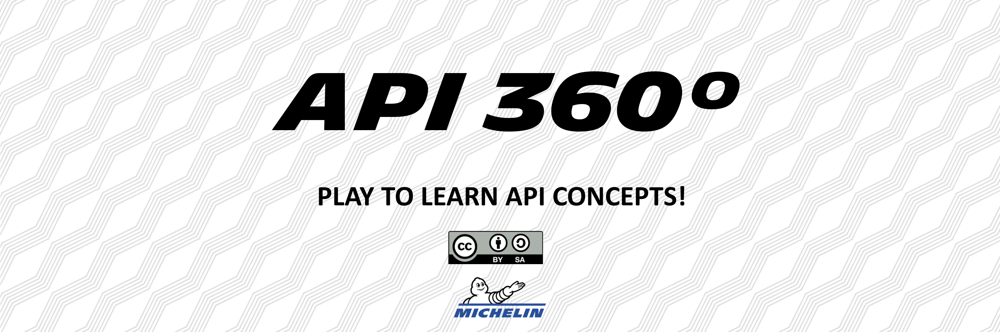

The API Fresco is a creative workshop concept which aims to build and test the API awareness. Targeting technical and non-technical profiles, it can help erasing fake-beliefs around APIs. The API Fresco explains some concepts and also show the links between these concepts.

This workshop is collaborative, empirical & entertaining.

**Ideal number of attendees: 4 to 8**  
**Format: on site or remotely with a digital workplace (Mural, Miro, Draft.io, etc.)**

## Table of contents
 - [Prerequisites](https://github.com/michelin/API-Fresco#prerequisites)
 - [The workshop](https://github.com/michelin/API-Fresco#the-workshop)
   - [Introduction](https://github.com/michelin/API-Fresco#1-introduction)
   - [Fresco build](https://github.com/michelin/API-Fresco#2-fresco-build)
   - [Conclusion](https://github.com/michelin/API-Fresco#3-conclusion)
 - [How to use this repository?](https://github.com/michelin/API-Fresco#how-to-use-this-repository)

## Prerequisites
- [x] An API expert, to facilitate the workshop,
- [x] A set of cards provided in this repository,
- [x] A digital workplace set up, if you want to do it remotely; a whiteboard if you want to do it on-site. Digital templates are provided in this repository.

## The workshop
This workshop takes place in three main phases: the introduction, the freco build and the conclusion.

### 1. Introduction

#### 1.1. Explain the workshop  
The Introduction's aim is for the attendees to understand how does the API Fresco plays out. 
Explain:
- [x] how will the game play out,
- [x] how the participants will interact, what they will have to do.

You will find these insights in the [section 2 - "Fresco build"](https://github.com/michelin/API-Fresco#2-fresco-build).

#### 1.2. Show them an example
For this example, you, as a facilitator, will do what the participants will have to do in the next phases.  

The "API" concept is the perfect one to begin with. Say to the attendees that this concept is assigned to you.  
You then explain the concept of APIs to the others and place it at the center of the fresco.  
Eventually, you explain that you don't draw links with other concepts as this is the first one, but for the next concept they will have to do so.

#### 1.3. Let them try the digital workplace (*Only for remote workshops*)
If the workshop is done remotely, the aim of this introduction phase is also for the participants to appropriate how to use the digital workplace.

- [x] Send them the link of the digital workplace
- [x] Explain them how to move on the fresco, and let them try
- [X] Explain them how to move an object on the fresco, and let them try

This step could seem optional but the experience shows that it is very valuable and really time-saving for the rest of the workshop.

### 2. Fresco build
The API Fresco build plays out in different waves.  
 
Each wave is the opportunity to discover 8 concepts and understand them. There is one concept by card.  
Each wave also complement the fresco by making the links between these concepts and the one already here on the fresco.

**Wave conduct**
1. *Reveal the concepts*  
    The 8 concepts of each waves are hidden to the attendees. The first step of the wave is to reveal the concepts to the participants, by spreading the cards on the table or unlocking the cover image (if done remotely).
    
2. *Assign the concepts to the participants*  
    Assign each concept to a participant. 2 cards per person if you have 4 attendees, etc.
 
3. *Let the participants read and understand their concepts*  
    The participants have 1 minute to read and understand the one or two concepts that are assigned to them.
    
4. *Presentation of the concept*  
    Pick one participant and ask him/her to explain the concept to the other attendees. Correct him/her if necessary.

5. *Positioning on the fresco*  
    The participant which just explained his/her concept put the card on the fresco and explain the links that he/she would draw with other concepts. The card shouldn't be linked with all other cards of the fresco. On average, a card is linked to 1 to 4 other cards.

6. *Validating the links*  
    The facilitator accepts the links and draw them on the fresco or disagree with some and explain why. In that case, the facilitator won't draw the links. The links are just lines on the whiteboard if done on-site; arrows on the digital workplace if done remotely.
    
7. *Iterations*  
    Go back to the step 4. untill all the current wave's concepts are positionned on the fresco, and start the next wave.

### 3. Conclusion
Once the workshop is over, it's time to collect some feedback!  

Ask the participants if they liked the workshop, if they learned something, what they will remember the more, etc. Collecting feedback is the best way to improve the workshop and its facilitation.  

Ask the participants to give you a ROTI, with a verbatim each time they dont mark 3. The digital templates are already ROTI-ready.

## How to use this repository?
