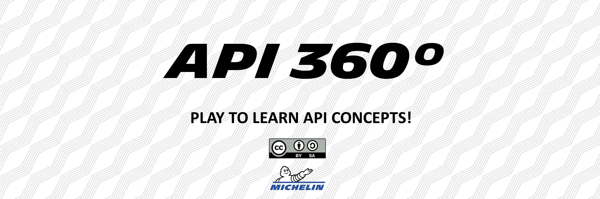
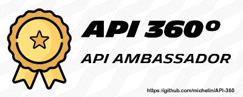
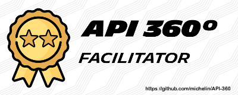

API 360° is a creative, educative workshop concept which aims to build and test the API awareness. Targeting technical and non-technical profiles, it can help understanding API concepts and erasing fake-beliefs around APIs. API 360° enables to highligh the links between these API concepts.

This workshop is collaborative & entertaining.

**Ideal number of attendees: 4 to 8**  
**Format: on site or remotely with a digital workplace (Mural, Miro, Draft.io, etc.)**

## Table of contents
 - [Prerequisites](https://github.com/michelin/API-360#prerequisites)
 - [The workshop](https://github.com/michelin/API-360#the-workshop)
   - [Setup](https://github.com/michelin/API-360#0-setup)
   - [Introduction](https://github.com/michelin/API-360#1-introduction)
   - [360](https://github.com/michelin/API-360#2-fresco-build)
   - [Conclusion](https://github.com/michelin/API-360#3-conclusion)
 - [How to use this repository?](https://github.com/michelin/API-360#how-to-use-this-repository)
 - [Badges](https://github.com/michelin/API-360#badges)

## Prerequisites
- [x] An API expert, to facilitate the workshop,
- [x] A set of "API 360°" cards. Either a physical deck or digital cards provided in this repository,
- [x] A digital workplace set up, if you want to do it remotely; a whiteboard or a large table if you want to do it on-site. Digital templates are provided in this repository.

## The workshop
After the setup by the facilitator, this workshop takes place in three main phases: the introduction, the "360°" and the conclusion.

### 0. Setup
This workshop can be played in dozens of different ways. Hence, the facilitator needs to define before the meeting what's its aim: educate managers or businesses about API concepts? Improve API Security awareness of a development team? etc.

All the different distributions of the workshop are available [here](./distributions.md)

### 1. Introduction

#### 1.1. Explain the workshop  
The Introduction's aim is for the attendees to understand how does API 360° plays out. 
Explain:
- [x] how will the game play out,
- [x] how the participants will interact, what they will have to do.

You will find these insights in the [section 2 - "360"](https://github.com/michelin/API-Fresco#2-360).

#### 1.2. Show them an example
For this example, you, as a facilitator, will do what the participants will have to do in the next phases.  

The "API" concept is the perfect one to begin with. Say to the attendees that this concept is assigned to you.  
You then explain the concept of APIs to the others and place it at the center of the board.  
Eventually, you explain that you don't draw links with other concepts as this is the first one, but for the next concept they will have to do so.

#### 1.3. Let them try the digital workplace (*Only for remote workshops*)
If the workshop is done remotely, the aim of this introduction phase is also for the participants to appropriate how to use the digital workplace.

- [x] Send them the link of the digital workplace
- [x] Explain them how to move on the board, and let them try
- [X] Explain them how to move an object on the board, and let them try

This step could seem optional but our experience shows that it is very valuable and really time-saving for the rest of the workshop.

### 2. 360
The 360 phase plays out in one or different waves (according to the chosen [distribution](./distribution.md)).  
 
Each wave is the opportunity to discover a bunch of concepts and understand them. There is one concept by card.  
Each wave also complements the board by making the links between these concepts and the ones already positioned on the board.

**Wave conduct**
1. *Reveal the concepts*  
    The concepts of each waves are hidden to the attendees. The first step of the wave is to reveal the concepts to the participants, by spreading the cards on the table or unlocking the cover image (if done remotely).
    
2. *Assign the concepts to the participants*  
    Assign each concept to a participant. 2 cards per person if you have a little number of attendees, etc.
 
3. *Let the participants read and understand their concepts*  
    The participants have 1 minute to read and understand the one or two concepts that are assigned to them.
    
4. *Presentation of the concept*  
    Pick the participants in sequence. Ask the person to explain the concept to the other attendees. Correct him/her if necessary.

5. *Positioning on the board*  
    The participant which just explained his/her concept put the card on the board and explain the links that he/she would draw with other concepts. The card shouldn't be linked with all other cards of the board. On average, a card is linked to 1 to 4 other cards.

6. *Validating the links*  
    The facilitator accepts the links and draw them on the board or disagree with some and explain why. The links are just lines on the whiteboard if done on-site; arrows on the digital workplace if done remotely.
    
7. *Iterations*  
    Go back to the step 4. untill all the current wave's concepts are positionned on the board, and start the next wave.

### 3. Conclusion
Once the workshop is over, it's time to collect some feedback!  

Ask the participants if they liked the workshop, if they learned something, what they will remember the more, etc. Collecting feedback is the best way to improve the workshop and its facilitation.  

Ask the participants to give you a ROTI, with a verbatim each time they dont mark 3. The digital templates are already ROTI-ready.

## How to use this repository?

- This repository will help you to know and understand the API 360° workshop.
- The cards needed to play the game are in this repository. You can download and print them. 
- You'll also find [digital workplace elements](./setup/), for you to quickly setup your own API 360° workshop.
- The LICENSE file details the licencing of the API 360° workshop.

This repository will evolve through the time, more API concepts, languages, badges, etc. will come soon. Stay tuned!

It is also for you the opportunity to contact us if you want to try this workshop for your company.

## Badges

**API Ambassador**  
A person who attended the API 360° workshop is becoming an API Ambassador. This person knows APIs and its related concepts and stakes.

  
[click here](https://github.com/michelin/API-Fresco/blob/main/img/Sticker_Ambassador.png) to find the badge in high resolution.

**API Facilitator**  
An API expert can become facilitator to spread the API Culture amonst his/her company. If you become a facilitator, contact us to join the network!

  
[click here](https://github.com/michelin/API-360/blob/main/img/Sticker_Facilitator.png) to find the badge in high resolution.
